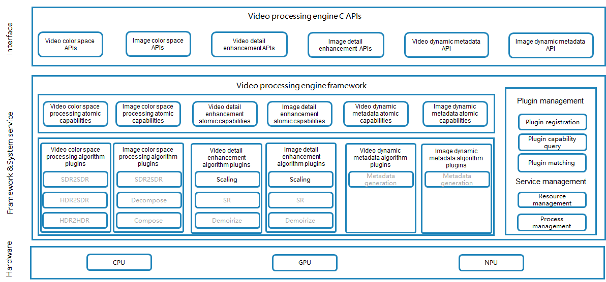

# VPE(multimedia_video_processing_engine)

## Overview
The Video Processing Engine (VPE) is a media engine for processing video and image data. It offers a range of fundamental capabilities including enhancements to details, contrast, luminance, and dynamic ranges. It also supports essential algorithms for color space conversion, scaling and upscaling, and dynamic metadata generation for transcoding, sharing, and post-processing for display.

The following figure demonstrates the VPE architecture.




#### 各模块功能说明

<table>
<tr>
<td bgcolor=#F5F5F5> Level </td>
<td bgcolor=#F5F5F5> module </td>
<td bgcolor=#F5F5F5> Description of the function </td>
</tr>
<tr>
<td rowspan="7" colspan="1" > Interface </td>
<td> Video color space CAPI </td>
<td> Provides interfaces for color space conversion in video scenes </td>
</tr>
<tr>
<td> Picture color space CAPI </td>
<td> Provides APIs for color space conversion of image scenes </td>
</tr>
<tr>
<td> Video detail enhancement CAPI </td>
<td> Provides APIs for video superresolution algorithms and sharpening algorithms </td>
</tr>
<tr>
<td> Picture detail enhancement CAPI </td>
<td> Provides APIs related to image superresolution algorithm and sharpening algorithm </td>
</tr>
<tr>
<td> Video dynamic metadata CAPI </td>
<td> APIs are provided for invoking dynamic metadata generation algorithms for video content </td>
</tr>
<tr>
<td> Image dynamic metadata CAPI </td>
<td> APIs are provided for dynamic metadata generation algorithms for image content </td>
</tr>
<tr>
<td> The TS interface is enhanced for image details </td>
<td> Provides TS interfaces for image super-resolution algorithm and sharpening algorithm </td>
</tr>
<tr>
<td rowspan="6" colspan="1" > Atomically capable encapsulation layer </td>
<td> Video color space atomic capabilities </td>
<td> Realize the channel scheduling and context management of the video scene color space conversion software, and realize the process control of the video stream </td>
</tr>
<tr>
<td> Picture color space atomic capability </td>
<td> Realize the color space conversion software channel scheduling of picture scenes </td>
</tr>
<tr>
<td> Video details enhance atomic capabilities </td>
<td> Realize video scene clarity enhancement and scaling algorithm software channel scheduling and context management, and realize video stream process control </td>
</tr>
<tr>
<td> Picture details enhance atomic capabilities </td>
<td> Realize the image scene clarity enhancement and scaling algorithm software channel scheduling </td>
</tr>
<tr>
<td> Dynamic metadata atomic capabilities for video </td>
<td> Realize the dynamic metadata generation software channel scheduling of video scenes </td>
</tr>
<tr>
<td> Dynamic metadata atomic capabilities for images </td>
<td> Realize the dynamic metadata generation software channel scheduling of image scenes </td>
</tr>
<tr>
<td rowspan="6" colspan="1" > Algorithm plug-in layer </td>
<td> Video color space processing algorithm plug-in </td>
<td> Implement the function of video color space conversion algorithm, including SDR2SDR, HDR2SDR, and HDR2HDR </td>
</tr>
<tr>
<td> Plug-in for image color space algorithms </td>
<td> Realize the function of image color space conversion algorithm, including SDR2SDR, single-layer to double-layer, double-layer to single-layer </td>
</tr>
<tr>
<td> Video Detail Enhancement Algorithm Plug-in </td>
<td> Implement video scaling and image quality enhancement algorithms </td>
</tr>
<tr>
<td> Plug-in for image detail enhancement algorithms </td>
<td> Implement image scaling and image quality enhancement algorithms </td>
</tr>
<tr>
<td> Video dynamic metadata algorithm plug-in </td>
<td> Implement the video dynamic metadata production algorithm </td>
</tr>
<tr>
<td> Image dynamic metadata algorithm plug-in </td>
<td> Implement the dynamic metadata generation algorithm for images </td>
</tr>
<tr>
<td rowspan="3" colspan="1"> Plugin management </td>
<td> Plugin registration </td>
<td> Provide the function of system developer plug-in registration </td>
</tr>
<tr>
<td> Capability inquiry </td>
<td> Application developers can use the capability query function to confirm whether a given plug-in is supported on that device or system </td>
</tr>
<tr>
<td> Plug-in calls </td>
<td> Invoke specific plug-in capabilities to complete related algorithm functions </td>
</tr>
<tr>
<td rowspan="2" colspan="1"> Service management </td>
<td> Resource management </td>
<td> Resource scheduling and algorithm context management, such as information about the frames before and after video content </td>
</tr>
<tr>
<td> Process management </td>
<td> Complete functions such as cross-process communication </td>
</tr>
</table>


| Dependency modules | Description of the function |
| :-- | :-- |
| graphic_graphic_surface | Provide video surface support |
| graphic_graphic_2d | Provide image surfacebuffer support |
| multimedia_media_foundation | Pixelmap support is available |
| multimedia_image_framework | Format parameter setting is supported |
| third_party_skia | Provides a scaling algorithm |

## Directory Structure

The structure of the repository directory is as follows:

```
/foundation/multimedia/video_processing_engine/
├── framework                                  # Framework code
│   ├── algorithm                              # Algorithm framework
│       ├── aihdr_enhancer                     # Image HDR enhancement algorithm framework
│       ├── aihdr_enhancer_video               # Video HDR enhancement algorithm framework
│       ├── colorspace_converter               # Image color space conversion algorithm framework
│       ├── colorspace_converter_display       # Image color space display algorithm framework
│       ├── colorspace_converter_video         # Video color space conversion algorithm framework
│       ├── common                             # Common
│       ├── contrast_enhancer                  # Contrast enhancement algorithm framework
│       ├── detail_enhancer                    # Image detail enhancement algorithm framework
│       ├── detail_enhancer_video              # Video detail enhancement algorithm framework
│       ├── extension_manager                  # Plugin management
│       ├── metadata_generator                 # Image metadata generation algorithm framework
│       ├── metadata_generator_video           # Video metadata generation algorithm framework
│       ├── video_variable_refresh_rate        # Video variable frame rate algorithm framework
│   ├── capi                                   # CAPI layer
│       ├── image_processing                   # Image CAPI
│       ├── video_processing                   # Video CAPI
│   ├── dfx                                    # DFX code
├── interfaces                                 # API layer
│   ├── inner_api                              # Internal APIs
│   ├── kits                                   # Application APIs
├── services                                   # Service code
├── sertestvices                               # Test code
```

## Build

Run the following command to build the VPE for the 32-bit ARM system:
```
./build.sh --product-name {product_name} --ccache --build-target video_processing_engine
```

Run the following command to build the VPE for the 64-bit ARM system:
```
./build.sh --product-name {product_name} --ccache --target-cpu arm64 --build-target video_processing_engine
```

**product_name** indicates the product supported, for example, **rk3568**.

## Description

### How to Use
As a component of OpenHarmony, the VPE provides video and image processing capabilities, including color space conversion, dynamic metadata generation, and detail enhancement.

#### The app developer calls the image scaling sample
1. Add a header file.
    ```cpp
    #include <hilog/log.h>
    #include <multimedia/image_framework/image_pixel_map_mdk.h>
    #include <multimedia/image_framework/image/pixelmap_native.h>
    #include <multimedia/video_processing_engine/image_processing.h>
    #include <multimedia/video_processing_engine/image_processing_types.h>
    #include <multimedia/player_framework/native_avformat.h>
    #include <napi/native_api.h>
    ```
2. Optionally, initialize the environment.
  Generally, it is called when it is used for the first time in the process, and some time-consuming operations can be completed in advance.
    ```cpp
    ImageProcessing_ErrorCode ret =  OH_ImageProcessing_InitializeEnvironment();
    ```
3. Create a detail enhancement module.
  Applications can create image detail enhancement modules by image processing engine module types. The variables in the example are described as follows:
  imageProcessor：an instance of the Detail Enhancement module.
  IMAGE_PROCESSING_TYPE_DETAIL_ENHANCER：Detail enhancement type.
  Expected return value: IMAGE_PROCESSING_SUCCESS
    ```cpp
    ImageProcessing_ErrorCode ret = OH_ImageProcessing_Create(&imageProcessor, IMAGE_PROCESSING_TYPE_DETAIL_ENHANCER);
    ```
4. (Optional) Configure the detail enhancement gear, there are currently three gears of high, medium and low and NONE optional, if not configured, the default gear is LOW.
    ```cpp
    OH_AVFormat* parameter = OH_AVFormat_Create();
    OH_AVFormat_SetIntValue(parameter, IMAGE_DETAIL_ENHANCER_PARAMETER_KEY_QUALITY_LEVEL,
        IMAGE_DETAIL_ENHANCER_QUALITY_LEVEL_HIGH);
    ImageProcessing_ErrorCode ret = OH_ImageProcessing_SetParameter(imageProcessor,parameter);
    ```
5. Initiates detail enhancement processing.
    ```cpp
    ImageProcessing_ErrorCode ret = OH_ImageProcessing_EnhanceDetail(imageProcessor, srcImage, dstImage);
    ```
6. Release the processing instance.
    ```cpp
    ImageProcessing_ErrorCode ret = OH_ImageProcessing_Destroy(imageProcessor);
    ```
7. Free up processing resources.
    ```cpp
    OH_ImageProcessing_DeinitializeEnvironment();
    ```
#### The app developer calls the video zoom sample
1. Add a header file.
    ```cpp
    #include <ace/xcomponent/native_interface_xcomponent.h>
    #include <multimedia/player_framework/native_avformat.h>
    #include <multimedia/video_processing_engine/video_processing.h>
    #include <multimedia/video_processing_engine/video_processing_types.h>
    #include <native_window/external_window.h>
    #include <native_buffer/native_buffer.h>
    ```
2. Optionally, create a decode instance.
  The input of the detail enhancement module can be a video stream decoded by the system, or the application can fill the window with video data (for example, the application directly fills the data into the window after internal soft decoding). If you select a system decoder to process a video file or video stream, you can create a decoder instance as input to the Detail Enhancement module.
    ```cpp
    OH_AVSource* source_ = OH_AVSource_CreateWithFD(inputFd, inputFileOffset, inputFileSize);
    OH_AVDemuxer* demuxer_ = OH_AVDemuxer_CreateWithSource(source_);
    auto sourceFormat = std::shared_ptr<OH_AVFormat>(OH_AVSource_GetSourceFormat(source_), OH_AVFormat_Destroy);
    OH_AVCodec * decoder_ = OH_VideoDecoder_CreateByMime(videoCodecMime.c_str());
    OH_AVFormat *format = OH_AVFormat_Create();
    OH_AVFormat_SetIntValue(format, OH_MD_KEY_WIDTH, videoWidth);
    OH_AVFormat_SetIntValue(format, OH_MD_KEY_HEIGHT, videoHeight);
    OH_AVFormat_SetDoubleValue(format, OH_MD_KEY_FRAME_RATE, frameRate);
    OH_AVFormat_SetIntValue(format, OH_MD_KEY_PIXEL_FORMAT, pixelFormat);
    OH_AVFormat_SetIntValue(format, OH_MD_KEY_ROTATION, rotation);
    int ret = OH_VideoDecoder_Configure(decoder_, format);
    OH_AVFormat_Destroy(format);
    OH_VideoDecoder_RegisterCallback(decoder_,
            {SampleCallback::OnCodecError, SampleCallback::OnCodecFormatChange,
            SampleCallback::OnNeedInputBuffer, SampleCallback::OnNewOutputBuffer}, videoDecContext_);

    int ret = OH_VideoDecoder_Prepare(decoder_);

    videoDecContext_ = new CodecUserData;
    ```
3. Optionally, initialize the environment.
  Generally, it is called when it is used for the first time in the process, and some time-consuming operations can be completed in advance.
    ```cpp
    VideoProcessing_ErrorCode ret = OH_VideoProcessing_InitializeEnvironment();
    ```
4. Create a detail enhancement module.
  Applications can create detail enhancement modules by video processing engine module types. The variables in the example are described as follows:
  videoProcessor：an instance of the Detail Enhancement module.
  VIDEO_PROCESSING_TYPE_DETAIL_ENHANCER：Detail enhancement type.
  Expected return value: VIDEO_PROCESSING_SUCCESS
    ```cpp
    VideoProcessing_ErrorCode ret = OH_VideoProcessing_Create(&videoProcessor， VIDEO_PROCESSING_TYPE_DETAIL_ENHANCER);
    ```
5. Configure an asynchronous callback function.
    ```cpp
    ret = OH_VideoProcessingCallback_Create(&callback);
    OH_VideoProcessingCallback_BindOnError(callback, OnError);
    OH_VideoProcessingCallback_BindOnState(callback, OnState);
    OH_VideoProcessingCallback_BindOnNewOutputBuffer(callback, OnNewOutputBuffer);
    ret = OH_VideoProcessing_RegisterCallback(videoProcessor, callback, this);
    void OnError(OH_VideoProcessing* videoProcessor, VideoProcessing_ErrorCode error, void* userData);
    void OnState(OH_VideoProcessing* videoProcessor, VideoProcessing_State state, void* userData);
    void OnNewOutputBuffer(OH_VideoProcessing* videoProcessor, uint32_t index, void* userData);
    ```
6. (Optional) Configure the detail enhancement gear, there are currently three gears of high, medium and low and NONE optional, if not configured, the default gear is LOW.
    ```cpp
    OH_AVFormat* parameter = OH_AVFormat_Create();
    OH_AVFormat_SetIntValue(parameter, VIDEO_DETAIL_ENHANCER_PARAMETER_KEY_QUALITY_LEVEL, VIDEO_DETAIL_ENHANCER_QUALITY_LEVEL_HIGH);
    OH_VideoProcessing_SetParameter(videoProcessor, parameter);
    ```
7. Get your Surface.
    ```cpp
    ret = OH_VideoProcessing_GetSurface(videoProcessor, inputWindow);
    OH_VideoDecoder_SetSurface(decoder_,  inputWindow_);
    ```
8. Set Surface
    ```cpp
    ret = OH_VideoProcessing_SetSurface(videoProcessor, outWindow);
    ```
9. Create a decoder input and output thread.
    ```cpp
    std::unique_ptr<std::thread> videoDecInputThread_ = std::make_unique<std::thread>(&Player::VideoDecInputThread, this);
    std::unique_ptr<std::thread> videoDecOutputThread_ = std::make_unique<std::thread>(&Player::VideoDecOutputThread, this);
    ```
10. Initiates detail enhancement processing.
    ```cpp
    int ret = OH_VideoDecoder_Start(decoder_);
    ret = OH_VideoProcessing_Start(videoProcessor);
    ```
11. Call OH_VideoProcessing_Stop()
    ```cpp
    VideoProcessing_ErrorCode ret = OH_VideoProcessing_Stop(videoProcessor);
    ```
12. Release the processing instance.
    ```cpp
    VideoProcessing_ErrorCode ret = OH_VideoProcessing_Destroy(videoProcessor)；
    VideoProcessing_ErrorCode ret = OH_VideoProcessingCallback_Destroy(callback);
    ```
13. Free up processing resources.
    ```cpp
    VideoProcessing_ErrorCode ret = OH_VideoProcessing_DeinitializeEnvironment();
    ```
#### Custom algorithm plugin registration
1. Implement plugin registration function
    ```cpp
    std::vector<MetadataGeneratorCapability> ImageMetadataGen::BuildCapabilities()
    {
        std::vector<MetadataGeneratorCapability> capabilities;
        for (const auto &inColorspace : inColorspaceList) {
            MetadataGeneratorCapability capability = { inColorspace, pixelFormatMap, RANK, IMAGEMETAGENVERSION };
            capabilities.emplace_back(capability);
        }
        return capabilities;
    }

    static std::vector<std::shared_ptr<OHOS::Media::VideoProcessingEngine::Extension::ExtensionBase>> RegisterExtensions()
    {
        std::vector<std::shared_ptr<OHOS::Media::VideoProcessingEngine::Extension::ExtensionBase>> extensions;
        auto extension = std::make_shared<OHOS::Media::VideoProcessingEngine::Extension::MetadataGeneratorExtension>();
        extension->info = { OHOS::Media::VideoProcessingEngine::Extension::ExtensionType::METADATA_GENERATOR,
        "ImageMetadataGen", "v1" };
        extension->capabilitiesBuilder = OHOS::Media::VideoProcessingEngine::ImageMetadataGen::BuildCapabilities;
        extensions.push_back(
            std::static_pointer_cast<OHOS::Media::VideoProcessingEngine::Extension::ExtensionBase>(extension));
        return extensions;
    }

    void RegisterImageMetadataGeneratorExtensions(uintptr_t extensionListAddr)
    {
        OHOS::Media::VideoProcessingEngine::Extension::DoRegisterExtensions(extensionListAddr, RegisterExtensions);
    }
    ```
2. Implement algorithm
    ```cpp
    ImageMetadataGen::Process(const sptr<SurfaceBuffer> &input)
    ```
3. Add registered plugin callback function.
  Add at staticExtensionsRegisterMap
    ```cpp
    const std::unordered_map<std::string, RegisterExtensionFunc> staticExtensionsRegisterMap = {
        {"ImageMetadataGeneratorExtensions", RegisterImageMetadataGeneratorExtensions}
    };
    ```

#### The system developer implements a custom algorithm plug-in registration example
The video processing engine provides algorithm plug-in registration interfaces such as color space conversion, dynamic metadata generation, and detail enhancement, and system users can register their own algorithms to enrich algorithm plug-ins. The video processing engine defines the basic classes of various algorithms, as follows:
| Function | Base class | 	Header file |
| :-- | :-- | :-- |
| Video color space conversion | ColorSpaceConverterBase | colorspace_converter_base.h |
| Picture color space conversion | ColorSpaceConverterBase | colorspace_converter_base.h |
| Video detail enhancement | DetailEnhancerBase | detail_enhancer_base.h |
| Picture detail enhancement | DetailEnhancerBase | detail_enhancer_base.h |
| Video dynamic metadata | MetadataGeneratorBase | metadata_generator_base.h |
| Image dynamic metadata | MetadataGeneratorBase | metadata_generator_base.h |

<br>
Take the scaling algorithm as an example, the plug-in algorithm has been implemented in framework/algorithm/extensions/skia, and the specific development steps are described below

1. Create a new folder in the framework/algorithm/extensions directory, for example, skia, along with the corresponding cpp and h files

2. The scaling algorithm header file is implemented, see framework/algorithm/extensions/skia/include/skia_impl.h

```cpp
#ifndef SKIA_IMPL_H
#define SKIA_IMPL_H

#include "surface_buffer.h"
#include "include/core/SkYUVAPixmaps.h"

#include "algorithm_errors.h"
#include "detail_enhancer_base.h"
#include "detail_enhancer_capability.h"

namespace OHOS {
namespace Media {
namespace VideoProcessingEngine {

class Skia : public DetailEnhancerBase {
public:
    Skia() = default;
    virtual ~Skia() = default;
    Skia(const Skia&) = delete;
    Skia& operator=(const Skia&) = delete;
    Skia(Skia&&) = delete;
    Skia& operator=(Skia&&) = delete;
    static std::unique_ptr<DetailEnhancerBase> Create();
    static DetailEnhancerCapability BuildCapabilities();
    VPEAlgoErrCode Init() override;
    VPEAlgoErrCode Deinit() override;
    VPEAlgoErrCode SetParameter(const DetailEnhancerParameters& parameter, int type, bool flag) override;
    VPEAlgoErrCode Process(const sptr<SurfaceBuffer>& input, const sptr<SurfaceBuffer>& output) override;
};
void RegisterSkiaExtensions(uintptr_t extensionListAddr);
} // VideoProcessingEngine
} // Media
} // OHOS
#endif // SKIA_IMPL_H
```
3. For details on plug-in algorithm capability registration and plug-in algorithm implementation, see framework/algorithm/extensions/skia/skia_impl.cpp

```cpp
#include "skia_impl.h"

#include <array>
#include <chrono>
#include <dlfcn.h>
#include "detail_enhancer_extension.h"
#include "utils.h"

#include "vpe_log.h"

namespace OHOS {
namespace Media {
namespace VideoProcessingEngine {

namespace {

constexpr Extension::Rank RANK = Extension::Rank::RANK_DEFAULT;
constexpr uint32_t VERSION = 0;
} // namespace

std::unique_ptr<DetailEnhancerBase> Skia::Create()
{
    return std::make_unique<Skia>();
}


DetailEnhancerCapability Skia::BuildCapabilities()
{
    std::vector<uint32_t> levels = { DETAIL_ENH_LEVEL_NONE, DETAIL_ENH_LEVEL_LOW, DETAIL_ENH_LEVEL_MEDIUM,
        DETAIL_ENH_LEVEL_HIGH_EVE, DETAIL_ENH_LEVEL_HIGH_AISR, DETAIL_ENH_LEVEL_VIDEO};
    DetailEnhancerCapability capability = { levels, RANK, VERSION };
    return capability;
}

VPEAlgoErrCode Skia::Init()
{
    return VPE_ALGO_ERR_OK;
}

VPEAlgoErrCode Skia::Deinit()
{
    return VPE_ALGO_ERR_OK;
}

VPEAlgoErrCode Skia::SetParameter([[maybe_unused]] const DetailEnhancerParameters& parameter,
    [[maybe_unused]] int type, [[maybe_unused]] bool flag)
{
    return VPE_ALGO_ERR_OK;
}

VPEAlgoErrCode Skia::Process(const sptr<SurfaceBuffer>& input, const sptr<SurfaceBuffer>& output)
{
    return errCode;
}

static std::vector<std::shared_ptr<Extension::ExtensionBase>> RegisterExtensions()
{
    std::vector<std::shared_ptr<Extension::ExtensionBase>> extensions;

    auto extension = std::make_shared<Extension::DetailEnhancerExtension>();
    CHECK_AND_RETURN_RET_LOG(extension != nullptr, extensions, "null pointer");
    extension->info = { Extension::ExtensionType::DETAIL_ENHANCER, "SKIA", "0.0.1" };
    extension->creator = Skia::Create;
    extension->capabilitiesBuilder = Skia::BuildCapabilities;
    extensions.push_back(std::static_pointer_cast<Extension::ExtensionBase>(extension));

    return extensions;
}

void RegisterSkiaExtensions(uintptr_t extensionListAddr)
{
    Extension::DoRegisterExtensions(extensionListAddr, RegisterExtensions);
}
} // VideoProcessingEngine
} // Media
} // OHOS
```

4. Add a callback function for registering a plug-in, and the VPE plug-in management will iterate through all plug-in registration functions.
 see framework/algorithm/extension_manager/include/static_extension_list.h
```cpp
const std::unordered_map<std::string, RegisterExtensionFunc> staticExtensionsRegisterMap = {
    { "Skia", RegisterSkiaExtensions },
};
```

## Repositories Involved

- [graphic_graphic_2d](https://gitee.com/openharmony/graphic_graphic_2d)
- [graphic_graphic_surface](https://gitee.com/openharmony/graphic_graphic_surface)
- [multimedia_image_framework](https://gitee.com/openharmony/multimedia_image_framework)
- [multimedia_media_foundation](https://gitee.com/openharmony/multimedia_media_foundation)
- [third_party_egl](https://gitee.com/openharmony/third_party_egl)
- [third_party_opengles](https://gitee.com/openharmony/third_party_opengles)
- [third_party_opencl-headers](https://gitee.com/openharmony/third_party_opencl-headers)
- [third_party_skia](https://gitee.com/openharmony/third_party_skia)
