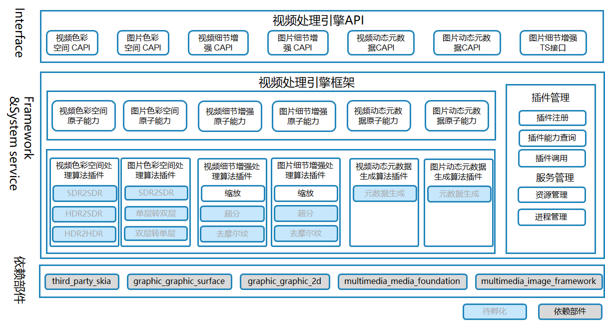

# VPE引擎（multimedia_video_processing_engine）

## 简介
VPE（Video Processing Engine）引擎是处理视频和图像数据的媒体引擎，包括细节增强、对比度增强、亮度增强、动态范围增强等基础能力，为转码、分享、显示后处理等提供色彩空间转换、缩放超分、动态元数据集生成等基础算法。

VPE引擎的主要结构如下图所示：



## 目录

仓目录结构如下：

```
/foundation/multimedia/video_processing_engine/
├── framework                                  # 框架代码
│   ├── algorithm                              # 算法框架
│       ├── aihdr_enhancer                     # 图像HDR增强算法框架
│       ├── aihdr_enhancer_video               # 视频HDR增强算法框架
│       ├── colorspace_converter               # 图像颜色空间转换算法框架
│       ├── colorspace_converter_display       # 图像颜色空间显示算法框架
│       ├── colorspace_converter_video         # 视频颜色空间转换算法框架
│       ├── detail_enhancer                    # 图像细节增强算法框架
│       ├── detail_enhancer_video              # 视频细节增强算法框架
│       ├── extension_manager                  # 插件管理
│       ├── metadata_generator                 # 图像元数据生成算法框架
│       ├── metadata_generator_video           # 视频元数据生成算法框架
│       ├── video_variable_refresh_rate        # 视频可变帧率算法框架
│   ├── capi                                   # CAPI层
│       ├── image_processing                   # 图像CAPI
│       ├── video_processing                   # 视频CAPI
│   ├── dfx                                    # dfx代码
├── interfaces                                 # 接口层
│   ├── inner_api                              # 系统内部接口
│   ├── kits                                   # 应用接口
├── services                                   # 服务代码
├── sertestvices                               # 测试代码
```

## 编译构建

编译32位ARM系统VPE引擎
```
./build.sh --product-name {product_name} --ccache --build-target video_processing_engine
```

编译64位ARM系统VPE引擎
```
./build.sh --product-name {product_name} --ccache --target-cpu arm64 --build-target video_processing_engine
```

{product_name}为当前支持的平台，比如rk3568。

## 说明

### 使用说明
VPE引擎作为OpenHarmony的组件，提供系统的视频图像能力，包含色彩空间转换、动态元数据生成以及细节增强等能力，供开发者进行图像和视频处理操作。

## 相关仓

- [graphic_graphic_2d](https://gitee.com/openharmony/graphic_graphic_2d)
- [graphic_graphic_surface](https://gitee.com/openharmony/graphic_graphic_surface)
- [multimedia_image_framework](https://gitee.com/openharmony/multimedia_image_framework)
- [multimedia_media_foundation](https://gitee.com/openharmony/multimedia_media_foundation)
- [third_party_egl](https://gitee.com/openharmony/third_party_egl)
- [third_party_opengles](https://gitee.com/openharmony/third_party_opengles)
- [third_party_opencl-headers](https://gitee.com/openharmony/third_party_opencl-headers)
- [third_party_skia](https://gitee.com/openharmony/third_party_skia)