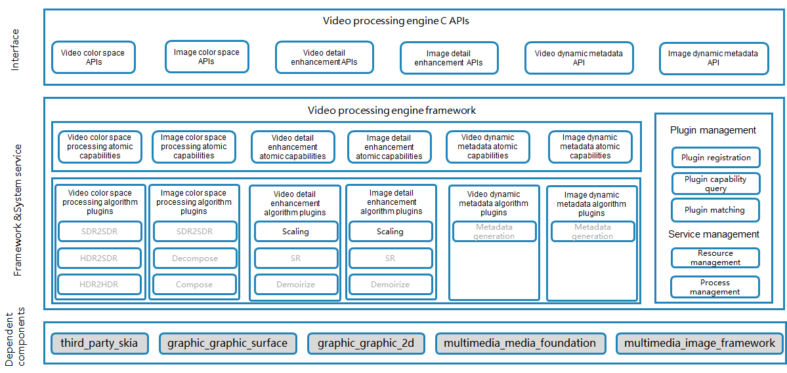

# VPE(multimedia_video_processing_engine)

## Overview
The Video Processing Engine (VPE) is a media engine for processing video and image data. It offers a range of fundamental capabilities including enhancements to details, contrast, luminance, and dynamic ranges. It also supports essential algorithms for color space conversion, scaling and upscaling, and dynamic metadata generation for transcoding, sharing, and post-processing for display.

The following figure demonstrates the VPE architecture.



## Directory Structure

The structure of the repository directory is as follows:

```
/foundation/multimedia/video_processing_engine/
├── framework                                  # Framework code
│   ├── algorithm                              # Algorithm framework
│       ├── aihdr_enhancer                     # Image HDR enhancement algorithm framework
│       ├── aihdr_enhancer_video               # Video HDR enhancement algorithm framework
│       ├── colorspace_converter               # Image color space conversion algorithm framework
│       ├── colorspace_converter_display       # Image color space display algorithm framework
│       ├── colorspace_converter_video         # Video color space conversion algorithm framework
│       ├── detail_enhancer                    # Image detail enhancement algorithm framework
│       ├── detail_enhancer_video              # Video detail enhancement algorithm framework
│       ├── extension_manager                  # Plugin management
│       ├── metadata_generator                 # Image metadata generation algorithm framework
│       ├── metadata_generator_video           # Video metadata generation algorithm framework
│       ├── video_variable_refresh_rate        # Video variable frame rate algorithm framework
│   ├── capi                                   # CAPI layer
│       ├── image_processing                   # Image CAPI
│       ├── video_processing                   # Video CAPI
│   ├── dfx                                    # DFX code
├── interfaces                                 # API layer
│   ├── inner_api                              # Internal APIs
│   ├── kits                                   # Application APIs
├── services                                   # Service code
├── sertestvices                               # Test code
```

## Build

Run the following command to build the VPE for the 32-bit ARM system:
```
./build.sh --product-name {product_name} --ccache --build-target video_processing_engine
```

Run the following command to build the VPE for the 64-bit ARM system:
```
./build.sh --product-name {product_name} --ccache --target-cpu arm64 --build-target video_processing_engine
```

**product_name** indicates the product supported, for example, **rk3568**.

## Description

### How to Use
As a component of OpenHarmony, the VPE provides video and image processing capabilities, including color space conversion, dynamic metadata generation, and detail enhancement.

## Repositories Involved

- [graphic_graphic_2d](https://gitee.com/openharmony/graphic_graphic_2d)
- [graphic_graphic_surface](https://gitee.com/openharmony/graphic_graphic_surface)
- [multimedia_image_framework](https://gitee.com/openharmony/multimedia_image_framework)
- [multimedia_media_foundation](https://gitee.com/openharmony/multimedia_media_foundation)
- [third_party_egl](https://gitee.com/openharmony/third_party_egl)
- [third_party_opengles](https://gitee.com/openharmony/third_party_opengles)
- [third_party_opencl-headers](https://gitee.com/openharmony/third_party_opencl-headers)
- [third_party_skia](https://gitee.com/openharmony/third_party_skia)
